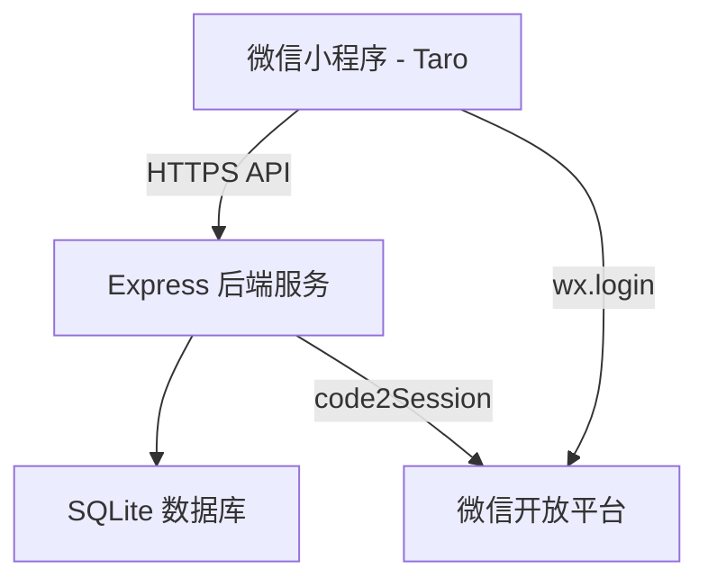
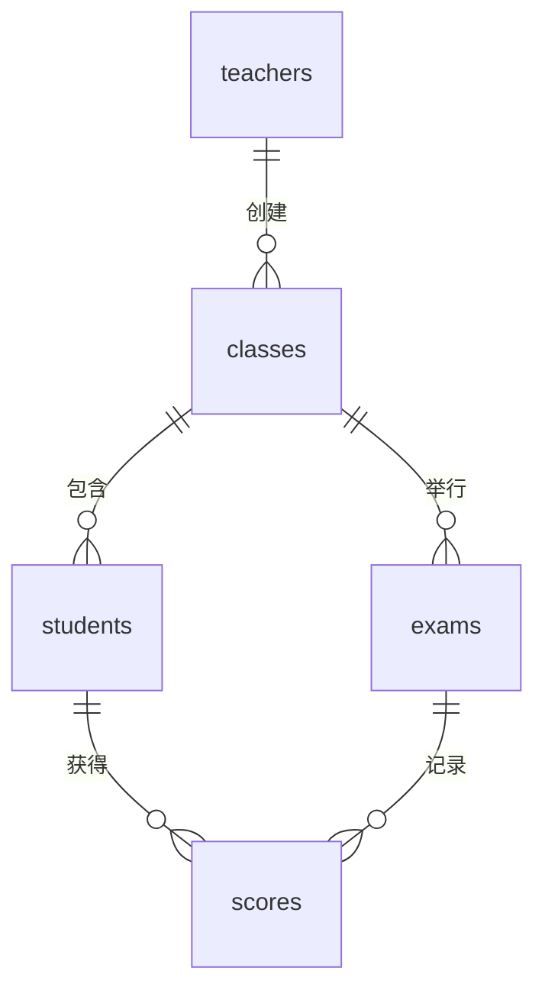

# 学生管理系统技术设计

Feature Name: student-management-miniapp
Updated: 2026-07-08

## 描述

基于 Taro + Express + SQLite 的学生管理系统微信小程序。教师通过微信小程序管理班级、学生信息和考试成绩，后端提供 RESTful API 服务进行数据持久化和业务逻辑处理。

## 架构



项目采用前后端分离架构，前端通过 HTTPS 请求调用后端 RESTful API，后端操作 SQLite 数据库完成数据持久化。用户认证使用微信小程序登录机制。

### 目录结构

```
student-management-miniapp/
├── frontend/                  # Taro 小程序前端
│   ├── src/
│   │   ├── pages/
│   │   │   ├── login/         # 登录页
│   │   │   ├── classes/       # 班级列表
│   │   │   ├── class-detail/  # 班级详情(学生+考试)
│   │   │   ├── student-form/  # 学生表单
│   │   │   ├── student-detail/# 学生详情
│   │   │   ├── exam-form/     # 考试表单
│   │   │   ├── score-entry/   # 成绩录入
│   │   │   └── score-stats/   # 成绩统计
│   │   ├── services/          # API 调用封装
│   │   ├── store/             # 状态管理
│   │   └── components/        # 公共组件
│   └── package.json
├── backend/                   # Express 后端
│   ├── src/
│   │   ├── routes/            # 路由定义
│   │   ├── controllers/       # 控制器
│   │   ├── models/            # 数据模型
│   │   ├── middleware/        # 中间件(认证等)
│   │   └── db.js              # 数据库初始化
│   └── package.json
└── start.sh                   # 启动脚本
```

## 组件和接口

### 前端页面组件

| 页面 | 路径 | 功能 |
|------|------|------|
| 登录页 | `/pages/login/index` | 微信授权登录 |
| 班级列表 | `/pages/classes/index` | 展示、创建和删除班级 |
| 班级详情 | `/pages/class-detail/index` | 学生列表、考试列表 |
| 学生表单 | `/pages/student-form/index` | 添加/编辑学生信息 |
| 学生详情 | `/pages/student-detail/index` | 学生信息、成绩记录 |
| 考试表单 | `/pages/exam-form/index` | 创建考试 |
| 成绩录入 | `/pages/score-entry/index` | 录入成绩 |
| 成绩统计 | `/pages/score-stats/index` | 成绩统计分析 |

### 后端 API 接口

#### 认证

| 方法 | 路径 | 说明 |
|------|------|------|
| POST | `/api/auth/login` | 微信登录,返回 JWT token |

#### 班级

| 方法 | 路径 | 说明 |
|------|------|------|
| GET | `/api/classes` | 获取教师所有班级 |
| POST | `/api/classes` | 创建班级 |
| DELETE | `/api/classes/:id` | 删除班级 |

#### 学生

| 方法 | 路径 | 说明 |
|------|------|------|
| GET | `/api/classes/:classId/students` | 获取班级学生列表 |
| POST | `/api/classes/:classId/students` | 添加学生 |
| PUT | `/api/students/:id` | 编辑学生信息 |
| GET | `/api/students/:id` | 获取学生详情(含成绩) |
| DELETE | `/api/students/:id` | 删除学生 |

#### 考试

| 方法 | 路径 | 说明 |
|------|------|------|
| GET | `/api/classes/:classId/exams` | 获取班级考试列表 |
| POST | `/api/classes/:classId/exams` | 创建考试 |

#### 成绩

| 方法 | 路径 | 说明 |
|------|------|------|
| POST | `/api/exams/:examId/scores` | 批量录入成绩 |
| GET | `/api/exams/:examId/scores` | 获取考试成绩列表 |
| GET | `/api/students/:id/scores` | 获取学生所有成绩 |

#### 统计

| 方法 | 路径 | 说明 |
|------|------|------|
| GET | `/api/exams/:examId/stats` | 考试成绩统计 |

## 数据模型

### teachers（教师表）

| 字段 | 类型 | 说明 |
|------|------|------|
| id | INTEGER PK | 主键 |
| openid | VARCHAR(64) UNIQUE | 微信 openid |
| name | VARCHAR(50) | 教师姓名 |
| avatar | VARCHAR(255) | 头像 URL |
| created_at | DATETIME | 创建时间 |

### classes（班级表）

| 字段 | 类型 | 说明 |
|------|------|------|
| id | INTEGER PK | 主键 |
| name | VARCHAR(100) | 班级名称 |
| teacher_id | INTEGER FK | 所属教师 |
| created_at | DATETIME | 创建时间 |

### students（学生表）

| 字段 | 类型 | 说明 |
|------|------|------|
| id | INTEGER PK | 主键 |
| name | VARCHAR(50) | 姓名 |
| student_no | VARCHAR(30) | 学号 |
| gender | VARCHAR(5) | 性别(男/女) |
| phone | VARCHAR(20) | 联系电话 |
| class_id | INTEGER FK | 所属班级 |
| created_at | DATETIME | 创建时间 |

### exams（考试表）

| 字段 | 类型 | 说明 |
|------|------|------|
| id | INTEGER PK | 主键 |
| name | VARCHAR(100) | 考试名称 |
| subject | VARCHAR(50) | 科目 |
| exam_date | DATE | 考试日期 |
| class_id | INTEGER FK | 所属班级 |
| created_at | DATETIME | 创建时间 |

### scores（成绩表）

| 字段 | 类型 | 说明 |
|------|------|------|
| id | INTEGER PK | 主键 |
| score | REAL | 分数 |
| student_id | INTEGER FK | 学生 |
| exam_id | INTEGER FK | 考试 |
| created_at | DATETIME | 创建时间 |

唯一约束: `(student_id, exam_id)` 组合唯一

### ER 图



## 正确性属性

- 教师只能查看和操作自己创建的班级
- 学生只能属于一个班级,成绩关联唯一的学生和考试组合
- 同一班级下学号必须唯一
- 成绩值域为 0 到 100
- 删除班级时级联删除其下所有学生、考试和成绩
- JWT token 过期后需要重新登录

## 错误处理

| 场景 | HTTP 状态码 | 错误信息 |
|------|------------|----------|
| 未登录或 token 过期 | 401 | 请先登录 |
| 无权访问资源 | 403 | 无权限 |
| 资源不存在 | 404 | 记录不存在 |
| 学号重复 | 409 | 该学号已存在 |
| 班级名称重复 | 409 | 班级名称已存在 |
| 成绩超出范围 | 422 | 成绩应在 0-100 之间 |
| 必填字段缺失 | 422 | 字段 XXX 为必填项 |
| 微信登录失败 | 400 | 登录失败,请重试 |
| 服务器内部错误 | 500 | 服务器异常 |

## 测试策略

- **后端单元测试**: 使用 Jest + Supertest 对 API 接口进行测试
- **测试覆盖**: 覆盖所有 API 端点的正常流程和异常分支
- **前端**: 手动测试页面交互,确保表单验证和数据展示正确
- **数据库**: 使用内存 SQLite 进行测试,确保测试隔离性

## 参考

[^1]: Taro 官方文档 - https://taro-docs.jd.com/
[^2]: Express.js 官方文档 - https://expressjs.com/
[^3]: SQLite 文档 - https://www.sqlite.org/docs.html
